<div align="center">

# 📬 Mail Project

### A full-stack email management system — Spring Boot 4 + Angular 17

*Compose, organise, filter, prioritise and manage email with a JSON-file-backed backend and a reactive single-page frontend.*


</div>

---

## 📑 Table of Contents

1. [Overview](#-overview)
2. [Feature Tour](#-feature-tour)
3. [System Architecture](#-system-architecture)
4. [Tech Stack](#-tech-stack)
5. [Repository & File Structure](#-repository--file-structure)
6. [Backend Deep Dive](#-backend-deep-dive)
7. [Frontend Deep Dive](#-frontend-deep-dive)
8. [Data Model & Storage](#-data-model--storage)
9. [REST API Reference](#-rest-api-reference)
10. [Key Flows (Sequence Diagrams)](#-key-flows-sequence-diagrams)
11. [Design Patterns](#-design-patterns)
12. [OOP Principles & SOLID](#-oop-principles--solid)
13. [Data Structures & Algorithms Used](#-data-structures--algorithms-used)
14. [Security Model](#-security-model)
15. [Getting Started](#-getting-started)
16. [Configuration](#-configuration)
17. [Testing](#-testing)
18. [Known Limitations & Roadmap](#-known-limitations--roadmap)

---

## 🔭 Overview

**Mail Project** is a Gmail-style web mail client with its own mail server logic. Users sign up with a `@gmail.com` address, and can then send mail to **other registered users of the system**, keep drafts, star messages, organise mail into custom folders, manage contacts, and tune their profile.

It is deliberately built **without a database**: every user owns a directory of JSON files, which makes the whole system easy to inspect, back up and reason about — and makes it a great showcase for **layered architecture and classic design patterns**.

| | Backend | Frontend |
|---|---|---|
| **Language** | Java 17 | TypeScript 5.3 |
| **Framework** | Spring Boot 4.0.0 (Web MVC) | Angular 17 (standalone components) |
| **Size** | 66 Java files · ~5,000 lines | 22 components · ~6,800 lines of TS (excl. specs) |
| **State** | Session (HttpSession) + JSON files | RxJS `BehaviorSubject` services |
| **Dev port** | `8080` (Spring default) | `4200` (`ng serve`) |

---

## ✨ Feature Tour

| Area | What you can do |
|---|---|
| 🔐 **Authentication** | Sign up (Gmail-only), log in, log out, server-side session validation, BCrypt-hashed passwords, 30-minute session timeout |
| 📥 **Mailboxes** | Inbox, Priority Inbox, Sent, Drafts, Trash, Starred |
| ✍️ **Compose** | New mail, reply, forward, save as draft, edit a draft, multi-recipient send with per-recipient success/failure report, 4 priority levels, attachments |
| 📎 **Attachments** | Base64 upload → stored on disk with UUID prefix → streamed back inline or as download |
| ⭐ **Starring** | Toggle star on any mail; the Starred view aggregates across inbox, sent, drafts and custom folders |
| 🗂️ **Custom folders** | Create / rename / recolour / delete folders; move mail between folders; live email counts |
| 🔎 **Search, filter & sort** | 9 combinable filters (Chain of Responsibility) and 8 sort orders (Strategy) executed server-side |
| 🗑️ **Trash lifecycle** | Delete moves to trash; delete again removes permanently; a nightly job purges mail older than 30 days |
| 👥 **Contacts** | Multiple emails/phones per contact, primary flags, avatar colour + initials, search, sort by name/email, server-side pagination |
| ⚙️ **Settings** | Edit profile (name, job title, phone, bio, photo), change password, **undo/redo** while editing (Command pattern on both tiers) |
| 🎮 **Dispatcher Mode** | Opt-in settings scaffold (position, auto-open, timeline/metrics toggles, AI-feature flags) toggled from the sidebar |
| 🔄 **Live updates** | 5-second polling; new mail is *held* and surfaced via a "new emails" indicator so the list never jumps under the cursor |
| 📖 **Reader pane** | Side reader with next/previous navigation across the current list |

---

## 🏗️ System Architecture

### High-level view

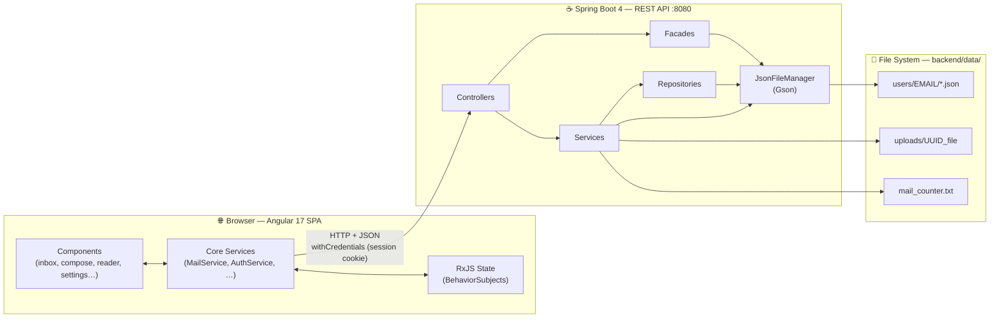

### Backend layering

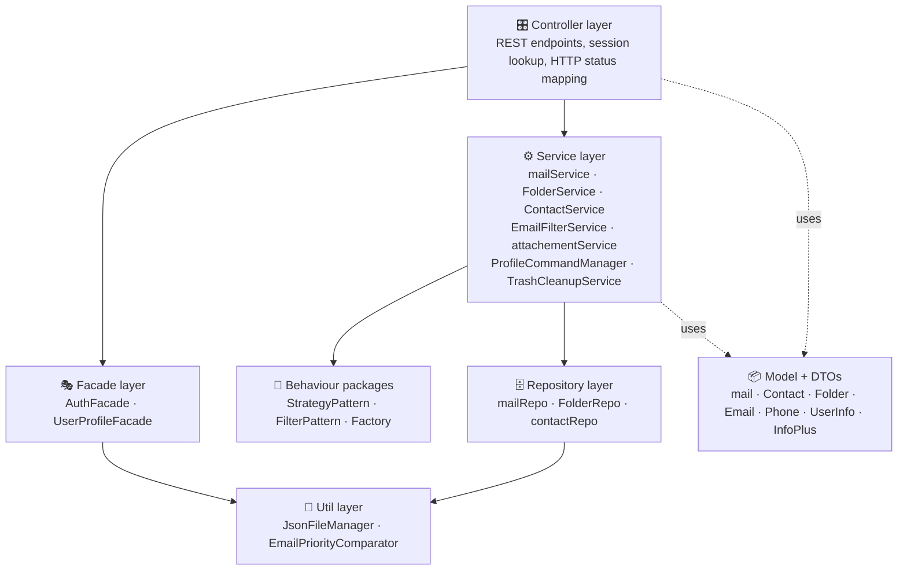

### Frontend layering

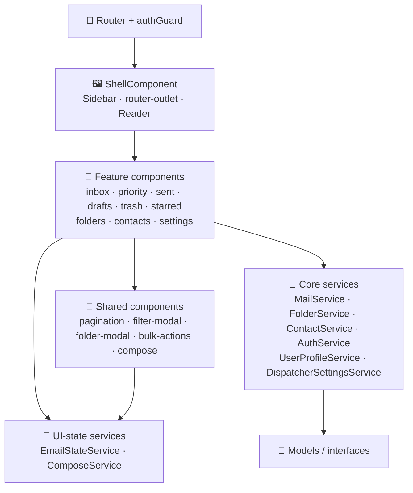

---

## 🧰 Tech Stack

### Backend

| Technology | Version | Purpose |
|---|---|---|
| **Java** | 17 | Language / runtime |
| **Spring Boot** (`spring-boot-starter-parent`) | 4.0.0 | Application framework, auto-configuration, DI container |
| `spring-boot-starter-webmvc` | — | REST controllers, `HttpSession`, CORS, request binding |
| `spring-boot-starter-validation` | — | Jakarta Bean Validation (`@Valid`, `@NotBlank`, `@Email`) |
| **Gson** | managed | JSON persistence (pretty-printed, custom `LocalDateTime` adapter) |
| **Jackson** annotations | managed | HTTP (de)serialisation hints such as `@JsonProperty` |
| **Lombok** | managed | `@Getter @Setter @Data @NoArgsConstructor @AllArgsConstructor` boilerplate removal |
| `spring-security-crypto` | managed | `BCryptPasswordEncoder` only (the full Spring Security filter chain is *not* used) |
| `spring-boot-devtools` | managed | Hot restart in development |
| **Maven Wrapper** | `mvnw` / `mvnw.cmd` | Reproducible builds with no local Maven |
| **PlantUML** | `src/main/plantuml/class-diagram.puml` | Source of the project's UML class diagram |
| JUnit 5 + `spring-boot-starter-*-test` | managed | Test scaffolding |

> Both **Gson** (file persistence) and **Jackson** (web layer) are present: the model classes carry both `@SerializedName` and `@JsonProperty` on the `isPrimary` field so the same class round-trips correctly in both worlds.

### Frontend

| Technology | Version | Purpose |
|---|---|---|
| **Angular** | ^17.2 | SPA framework — **standalone components**, no NgModules |
| **TypeScript** | ~5.3 | Typed application code |
| **RxJS** | ~7.8 | Reactive state, polling (`interval` + `switchMap`), event streams |
| **Zone.js** | ~0.14 | Change detection |
| **Tailwind CSS** | ^3.4 | Utility styling (custom palette: `navy`, `darkBlue`, `neon`, `tealSoft`; neon glow shadow; `Orbitron` futuristic font family) |
| **PostCSS + Autoprefixer** | ^8.5 / ^10.4 | CSS pipeline |
| **Lucide Angular** | ^0.555 | Icon set (star, paperclip, filter, trash, etc.) |
| **Font Awesome Free** | ^7.1 | Additional icons (loaded globally in `angular.json`) |
| **Google Fonts** | — | Cherry Bomb One, Belanosima, Kalam, Tanker (linked in `index.html`) |
| **Karma + Jasmine** | ~6.4 / ~5.1 | Unit-test runner |
| **Angular CLI** | ^17.2 | Build, serve, test (`application` builder) |

> 📝 `package.json` also declares `animejs`, `gsap`, `daisyui`, `flowbite`, `ngx-toastr`, `ngx-pagination` and `@ngneat/tailwind`. No imports of these were found in `src/` — pagination is a hand-written `PaginationComponent`. They are candidates for removal (see [Roadmap](#-known-limitations--roadmap)).

---

## 📂 Repository & File Structure

```text
Mail-Project-master/
├── README.md
│
├── backend/                                   ☕ Spring Boot application
│   ├── pom.xml                                Maven build (Java 17, Boot 4.0.0)
│   ├── mvnw / mvnw.cmd                        Maven wrapper scripts
│   ├── data/                                  💾 RUNTIME DATA (created/used relative to CWD)
│   │   ├── mail_counter.txt                   Global auto-increment mail id
│   │   ├── uploads/                           Attachments: <uuid>_<originalName>
│   │   └── users/
│   │       └── <email>/                       One directory per user
│   │           ├── info.json                  Account (name, BCrypt hash, phone, birth date)
│   │           ├── infoplus.json              Extended profile + Dispatcher settings
│   │           ├── inbox.json  sent.json  draft.json  trash.json
│   │           ├── contacts.json              Address book
│   │           ├── folders.json               Custom-folder metadata
│   │           └── folder_<id>.json           Mail inside one custom folder
│   └── src/
│       ├── main/
│       │   ├── plantuml/class-diagram.puml    Full UML class diagram source
│       │   ├── resources/application.properties
│       │   └── java/com/example/backend/
│       │       ├── BackendApplication.java    @SpringBootApplication + @EnableScheduling
│       │       ├── config/                    CorsConfig
│       │       ├── controller/                6 REST controllers
│       │       ├── facade/                    AuthFacade, UserProfileFacade
│       │       ├── service/                   7 services + ProfileCommandManager
│       │       ├── Repo/                      mailRepo, FolderRepo, contactRepo
│       │       ├── Factory/                   mailFactory, ContactFactory, FolderFactory
│       │       ├── StrategyPattern/           Email + contact sort strategies
│       │       ├── FilterPattern/             Chain-of-Responsibility email filters
│       │       ├── model/                     Domain objects
│       │       ├── DTOS/                      Request/response contracts
│       │       ├── Exceptions/                UserNotFoundException
│       │       └── Util/                      JsonFileManager, EmailPriorityComparator
│       └── test/java/.../BackendApplicationTests.java
│
└── mail-Frontend/                             🅰️ Angular 17 application
    ├── angular.json                           Build configs: production / development / dev2
    ├── tailwind.config.js  postcss.config.js
    ├── package.json  tsconfig*.json
    └── src/
        ├── index.html  main.ts  styles.css    Entry point, global styles, Tailwind directives
        ├── environments/                      environment1.ts (:8080) · environment2.ts (:8081)
        ├── assets/                            animations.css + ~40 PNG icons
        └── app/
            ├── app.component.*                Root: router-outlet + global Compose overlay
            ├── app.config.ts  app.routes.ts   Providers (router, HttpClient) · route table
            ├── core/
            │   ├── guards/auth.guard.ts       Functional route guard
            │   ├── models/                    TS interfaces (Email, Contact, FilterCriteria…)
            │   ├── services/                  Mail, Auth, Folder, Contact, Profile, Dispatcher,
            │   │                              EmailState, Compose
            │   └── utils/                     (placeholders — currently empty files)
            ├── layout/
            │   ├── shell/                     Authenticated layout frame
            │   └── sidebar/                   Navigation, counts, folders, Dispatcher toggle
            ├── loginpage/                     login/ · signup/
            ├── inbox/                         inbox-list · priority-inbox · sent-list ·
            │                                  draft-list · trash-list · starred-list · bulk-actions
            ├── reader/                        Email reader pane
            └── components/
                ├── compose/                   Compose / reply / forward / draft editor
                ├── contacts/                  Contacts manager
                ├── folders-page/  folder-view/  folder-modal/
                ├── filter-modal/              Advanced filter dialog
                ├── pagination/                Reusable pager
                ├── settings/                  Profile + password + undo/redo
                │   └── commands/              Command pattern (frontend)
                └── not-found/                 404 page
```

---

## ☕ Backend Deep Dive

Base package: `com.example.backend`

### Controllers (`controller/`)

| Controller | Base path | Responsibility |
|---|---|---|
| `AuthController` | `/api/auth` | Signup, login (fresh session each time), session validation, logout |
| `mailController` | `/api/mail` | Mailbox listing (filter + sort), read one, compose/send, drafts, delete, move, star |
| `FolderController` | `/api/folders` | CRUD for custom folders, list a folder's mail, adjust email counts |
| `ContactController` | `/api/contacts` | Paginated/searchable/sortable contacts CRUD with `@Valid` bodies |
| `UserProfileController` | `/api/user` | Profile read/update, password change, Dispatcher settings, undo/redo endpoints |
| `AttachmentController` | `/api/attachments` | Streams a stored attachment inline with probed content type |

Controllers resolve the current user from `HttpSession.getAttribute("currentUser")`, delegate to a facade or service, and translate results into `ResponseEntity` status codes. `ContactController` and `FolderController` also expose a `@ExceptionHandler(MethodArgumentNotValidException)` that returns a `field → message` map.

### Facades (`facade/`)

| Class | Hides |
|---|---|
| `AuthFacade` | Gmail-only rule, duplicate check, creation of the user directory + `info.json` + `infoplus.json`, BCrypt hashing, password verification |
| `UserProfileFacade` | Reading/merging `info.json` + `infoplus.json` into one profile map, field-level change recording for undo/redo, base64 photo validation, name splitting, password change, Dispatcher settings load/save/toggle |

### Services (`service/`)

| Service | Responsibility |
|---|---|
| `mailService` | Compose & deliver mail, drafts, move between folders, unified "list → filter → sort" pipeline for every mailbox, priority-queue inbox |
| `EmailFilterService` | Builds the filter chain from `FilterCriteriaDTO` and runs it; `hasActiveFilters()` short-circuit |
| `FolderService` | Folder CRUD orchestration (factory + repo + creating/deleting the `folder_<id>.json` file) and DTO mapping |
| `ContactService` | Search, strategy-based sort, pagination, add/update/delete, entity → DTO mapping |
| `attachementService` | Decodes base64 payloads, writes `data/uploads/<uuid>_<name>`, rewrites `filePath`; skips already-saved files |
| `ProfileCommandManager` | Per-user undo/redo stacks of `ProfileChange` (max 50 entries, 30-min TTL, `ConcurrentHashMap` + synchronisation) |
| `TrashCleanupService` | `@Scheduled` nightly job (`0 0 2 * * *`) that permanently deletes mail trashed more than **30 days** ago |

### Repositories (`Repo/`)

| Repository | File(s) it fronts | Notable methods |
|---|---|---|
| `mailRepo` | `inbox/sent/draft/trash.json`, `folder_*.json` | `getInboxEmails`, `getEmailById`, `deleteEmail` (move-to-trash or permanent), `toggleStar`, `getStarredEmails` (aggregates + tags source folder) |
| `FolderRepo` | `folders.json` | `findAll`, `findById`, `save` (upsert), `delete`, `updateEmailCount`, `incrementEmailCount` |
| `contactRepo` | `contacts.json` | `findAll` (null-safe lists), `saveAll` |

### Utilities (`Util/`)

* **`JsonFileManager`** — the single gateway to the file system. Generic `readListFromFile(path, Type)` / `writeListToFile(path, list)`, `createUserFolder`, `userExists`, `deleteFile`, `getUserFolderPath`. Contains a `GsonBuilder` pipeline with pretty-printing and a custom `LocalDateTime` ⇄ ISO-8601 adapter.
* **`EmailPriorityComparator`** — orders by priority ascending (1 = most urgent), ties broken by newest timestamp first.

### Models & DTOs

| Type | Classes |
|---|---|
| **Domain models** | `mail`, `Contact`, `Email`, `Phone`, `Folder`, `UserInfo`, `InfoPlus` (+ nested `DispatcherSettings`) |
| **DTOs** | `mailContentDTO`, `attachementDTO`, `FilterCriteriaDTO`, `contactRequestDTO`, `contactResponseDTO`, `PaginatedContactResponse`, `FolderRequestDTO`, `FolderResponseDTO`, `SignupRequest`, `LoginRequest`, `ProfileUpdateRequest`, `PasswordChangeRequest`, `DispatcherSettingsDTO` |
| **Exception** | `UserNotFoundException` (checked) — thrown when a recipient is unknown or equals the sender |

### Filtering pipeline (Chain of Responsibility)

`EmailFilterService.buildFilterChain()` links eight filters in a fixed order. A filter whose criterion is empty simply forwards the list to the next link.

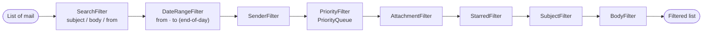

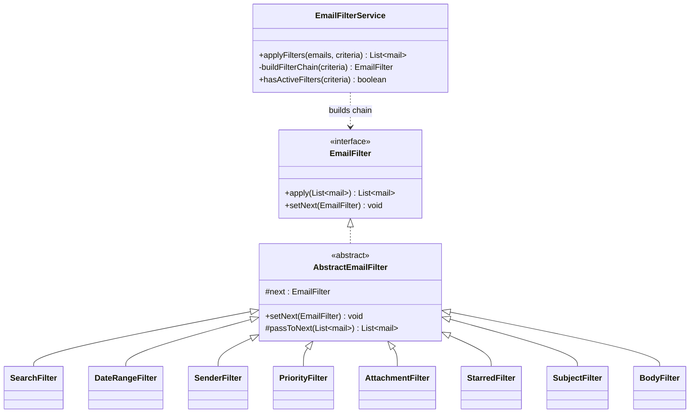

### Sorting (Strategy)

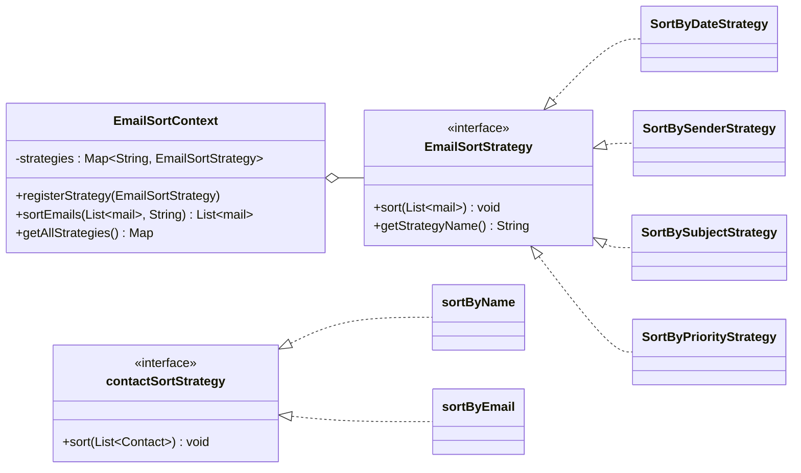

Every email strategy is parameterised by an `ascending` flag and registered under a key, giving eight selectable orders:

| Key | Meaning | Key | Meaning |
|---|---|---|---|
| `date-asc` / `date-desc` | By timestamp (nulls last) | `subject-asc` / `subject-desc` | Case-insensitive subject |
| `sender-asc` / `sender-desc` | Case-insensitive `from` | `priority-asc` / `priority-desc` | Via a `PriorityQueue` |

Unknown keys fall back to `date-desc`.

### Mailbox query pipeline

All mailbox endpoints (`inbox`, `sent`, `draft`, `trash`, `starred`, `folder/{id}`) share the same shape inside `mailService`:

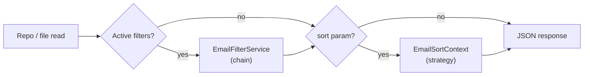

### Mail lifecycle

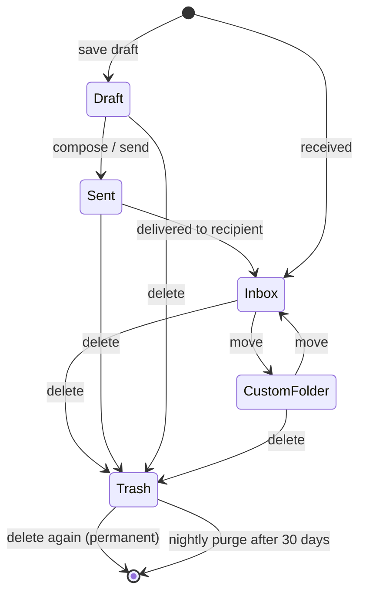

---

## 🅰️ Frontend Deep Dive

### Bootstrap & routing

`main.ts` → `bootstrapApplication(AppComponent, appConfig)` with `provideRouter(routes)` and `provideHttpClient()`. There are **no NgModules** — every component is `standalone: true` and lists its own `imports`.

| Path | Component | Guard |
|---|---|---|
| `''` | redirect → `/inbox` | — |
| `/login`, `/signup` | `LoginComponent`, `SignupComponent` | public |
| `/inbox` | `InboxListComponent` | `authGuard` |
| `/priority` | `PriorityInboxComponent` | `authGuard` |
| `/sent`, `/drafts`, `/trash`, `/starred` | `SentList`, `DraftList`, `TrashList`, `StarredList` | `authGuard` |
| `/contacts` | `ContactsComponent` | `authGuard` |
| `/folders`, `/folder/:id` | `FoldersPageComponent`, `FolderViewComponent` | `authGuard` |
| `/settings` | `SettingsComponent` | `authGuard` |
| `**` | `NotFoundComponent` | — |

All protected routes are children of `ShellComponent`, so the guard is declared once. The guard is a **functional `CanActivateFn`**: it first checks `localStorage.currentUser`, then calls `GET /api/auth/validate` so a stale client can never get past an expired server session.

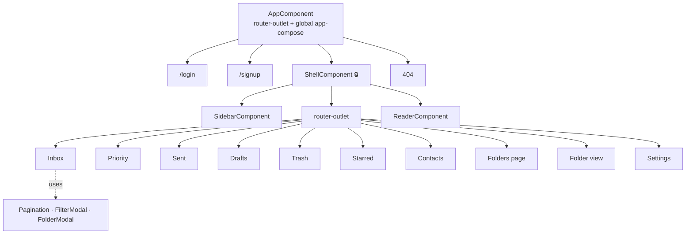

### Components

| Component | Role |
|---|---|
| `ShellComponent` | Authenticated frame: sidebar + outlet + reader (reader visibility from `EmailStateService`) |
| `SidebarComponent` | Navigation, live folder counts from the folder streams, custom-folder list, profile summary, Dispatcher toggle |
| `InboxList` / `SentList` / `DraftList` / `TrashList` / `StarredList` / `FolderView` | Mailbox views: server-side filter + sort, client pagination, multi-select action bar, move/delete/star |
| `PriorityInboxComponent` | Mail grouped into four collapsible `PrioritySection`s (levels 1–4) |
| `BulkActionsComponent` | Shared multi-select action UI |
| `ReaderComponent` | Reading pane: reply, forward, star, delete, attachment view/download, next/previous |
| `ComposeComponent` | Overlay editor for new / reply / forward / draft / edit-draft modes |
| `FilterModalComponent` | `@Input currentFilters`, `@Output applyFilters / clearFilters / close` |
| `PaginationComponent` | Reusable pager (`currentPage`, `totalItems`, `itemsPerPage`, `maxVisiblePages`; emits `pageChange`, `itemsPerPageChange`) |
| `FoldersPageComponent`, `FolderModalComponent` | Folder grid + create/edit dialog |
| `ContactsComponent` | Contacts table with search, sort, pagination, multi-email/phone forms |
| `SettingsComponent` | Profile + password forms with undo/redo via `CommandManager` |
| `Login` / `Signup` / `NotFound` | Entry and error pages |

### Services

| Service | Responsibility |
|---|---|
| `MailService` | Central mail API client: per-folder `BehaviorSubject`s, `mapBackendToFrontend` adapter, polling with **held pending updates**, star/delete/move/compose/draft, attachment URL/download helpers, file-size & icon helpers |
| `AuthService` | `signup`, `login`, `logout`, `validateSession` (all `withCredentials`) |
| `FolderService` | Custom-folder CRUD and email counts |
| `ContactService` | Paginated contacts CRUD |
| `UserProfileService` | `getProfile()` |
| `DispatcherSettingsService` | `settings$` stream, `loadSettings`, `save`, `toggle`, `isLoaded` |
| `EmailStateService` | Reader state: selected mail, open flag, current list + index, next/previous |
| `ComposeService` | Compose overlay open/close and mode payload (`ComposeData`) |
| `CommandManager` | Undo/redo history for the settings form (max 50) |

### Reactive state & the "held polling" model

State is held in **services, not components**, using `BehaviorSubject` (current value + replay to late subscribers) exposed as read-only `Observable`s (`inboxEmails$`, `sentEmails$`, …).

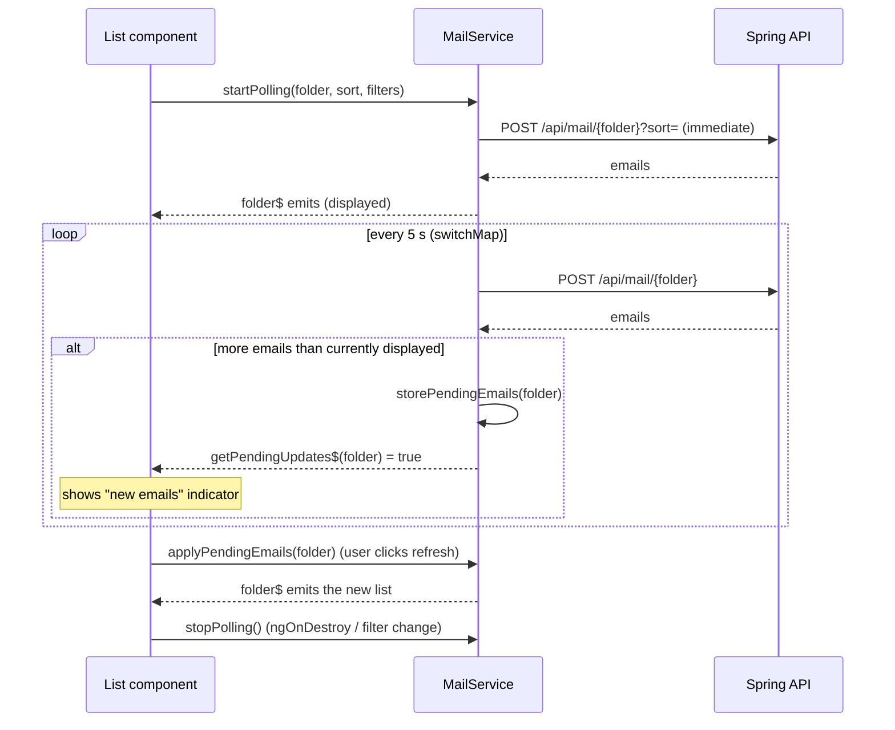

`switchMap` guarantees that a slow response is dropped if the next tick fires, and holding results avoids rows shifting while the user is about to click.

### Compose modes

`ComposeService.composeData$` carries a `ComposeData` object so one `ComposeComponent` serves five cases:

| Method | Flags set | Pre-fills |
|---|---|---|
| `openCompose()` | none | blank |
| `openReply(sender, subject, body)` | `isReplyMode` | recipient + quoted subject/body |
| `openForward(subject, body, attachments)` | `isForwardMode` | subject/body + attachments |
| `openDraft(...)` | `isDraftMode` | draft fields + priority + attachments |
| `openEditDraft(...)` | `isEditDraftMode` | editable draft, `draftId` retained |

### Client-side Command pattern (Settings)

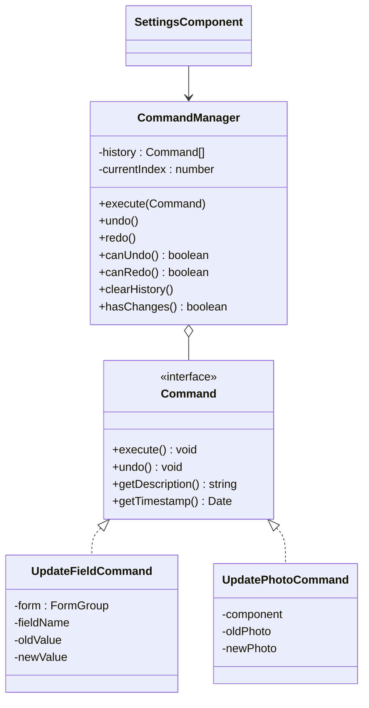

Executing a new command **truncates the redo tail** (`history.slice(0, currentIndex + 1)`) and history is capped at 50 entries.

### Styling

Tailwind utilities for layout, per-component CSS files for bespoke styling, `assets/animations.css` for keyframes (floating envelope, glow pulse), a teal/navy "neon" palette in `tailwind.config.js`, and Font Awesome + Lucide icons. Build budgets in `angular.json` warn at 500 kB / error at 1 MB for the initial bundle.

---

## 💾 Data Model & Storage

There is no database. `JsonFileManager` serialises lists of objects to pretty-printed JSON, and **each user is a directory**.

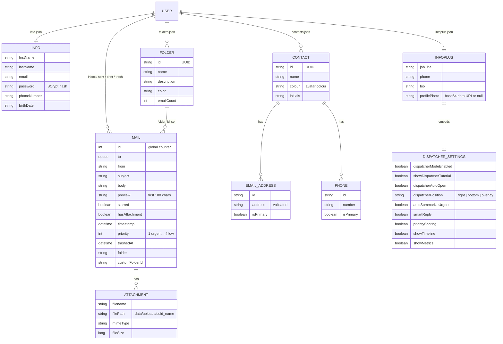

**Ids:** mail ids come from a process-wide counter persisted in `data/mail_counter.txt` (loaded in a `static` block of `mailFactory`); folder and contact ids are UUIDs. **Attachments** are saved as `data/uploads/<uuid>_<originalName>` and referenced by relative path inside the mail JSON.

**Sample `inbox.json` entry**

```json
{
  "id": 274,
  "from": "alice@gmail.com",
  "subject": "Quarterly numbers",
  "body": "…",
  "preview": "…",
  "starred": false,
  "hasAttachment": true,
  "timestamp": "2025-12-18T06:16:08.0585827",
  "priority": 1,
  "attachments": [
    { "filename": "report.pdf",
      "filePath": "data/uploads/6a79a82a-…_report.pdf",
      "mimeType": "application/pdf",
      "fileSize": 244521 }
  ]
}
```

---

## 🌐 REST API Reference

All endpoints expect the session cookie (`withCredentials: true` on the client).

### Auth — `/api/auth`

| Method | Path | Body | Notes |
|---|---|---|---|
| POST | `/signup` | `SignupRequest` (`firstName, lastName, email, password, phoneNumber, birthDate`) | `@gmail.com` only; rejects duplicates |
| POST | `/login` | `LoginRequest` (`email, password`) | Invalidates old session, creates new, timeout 1800 s |
| GET | `/validate` | — | `200` with email, or `401` |
| POST | `/logout` | — | Invalidates session |

### Mail — `/api/mail`

| Method | Path | Params / Body | Description |
|---|---|---|---|
| POST | `/inbox` `/sent` `/draft` `/trash` `/starred` | `?sort=date-desc` · body `FilterCriteriaDTO` (optional) | List with server-side filter + sort |
| GET | `/inbox/priority` | — | Inbox ordered by priority, then newest |
| POST | `/folder/{folderId}` | `?sort=` · `FilterCriteriaDTO` | Mail in a custom folder |
| GET | `/{id}` | `?folder=` | One mail |
| POST | `/compose` | `mailContentDTO` | Send to one or many recipients; `200` all ok · `207` partial · `400` all failed |
| POST | `/draft/save` | `mailContentDTO` | Save draft (attachments persisted) |
| PUT | `/{id}/star` | `?folder=` | Toggle star |
| PUT | `/{id}/move` | `?fromFolder=&toFolder=` | Move between folder files |
| DELETE | `/{id}` | `?folder=` | To trash; if already in `trash` → permanent |

<details>
<summary><b>Request body shapes</b></summary>

```jsonc
// POST /api/mail/compose   (field names are the actual contract, typos included)
{
  "subject": "Hello",
  "body": "Hi there",
  "recipients": ["bob@gmail.com", "carol@gmail.com"],
  "piriority": 2,                    // 1 urgent · 2 high · 3 medium · 4 low
  "attachements": [
    { "filename": "a.pdf", "filePath": "<base64>", "mimeType": "application/pdf", "fileSize": 1234 }
  ]
}

// POST /api/mail/inbox?sort=priority-asc   (every field optional)
{
  "searchTerm": "invoice",
  "dateFrom": "2025-01-01T00:00:00",
  "dateTo":   "2025-12-31T00:00:00",
  "sender": "alice",
  "priority": [1, 2],
  "hasAttachment": true,
  "isStarred": false,
  "subjectContains": "Q4",
  "bodyContains": "total"
}
```
</details>

### Folders — `/api/folders`

| Method | Path | Description |
|---|---|---|
| GET | `/` | List folders |
| GET | `/{id}` | One folder |
| POST | `/` | Create (`name, description, color`) |
| PUT | `/{id}` | Update |
| DELETE | `/{id}` | Delete folder + its mail file |
| GET | `/{id}/emails` | Mail in the folder |
| PATCH | `/{id}/count` | Body `{ "count": n }` |
| PATCH | `/{id}/increment` | Body `{ "increment": n }` |

### Contacts — `/api/contacts`

| Method | Path | Description |
|---|---|---|
| GET | `/?page=&size=&search=&sortBy=name\|email` | Paginated list → `{ contacts: [...], totalItems }` (page is **0-based**) |
| POST | `/` | Create (`name, emails[], phones[]`) → `201` |
| PUT | `/{id}` | Update |
| DELETE | `/{id}` | Delete → `204` |

### User — `/api/user`

| Method | Path | Description |
|---|---|---|
| GET / PUT | `/profile` | Read / update profile |
| PUT | `/password` | Change password (min 8 chars, confirmation must match) |
| GET / PUT | `/dispatcher-settings` | Read / replace Dispatcher settings |
| POST | `/dispatcher-toggle` | Body `{ "enabled": true }` |
| POST | `/profile/undo`, `/profile/redo` | Server-side history navigation |
| GET | `/profile/can-undo`, `/can-redo`, `/has-changes` | History state flags |

### Attachments — `/api/attachments`

| Method | Path | Description |
|---|---|---|
| GET | `/uploads/{filename}` | Streams the file inline with probed `Content-Type` |

---

## 🔄 Key Flows (Sequence Diagrams)

### 1. Login & route protection

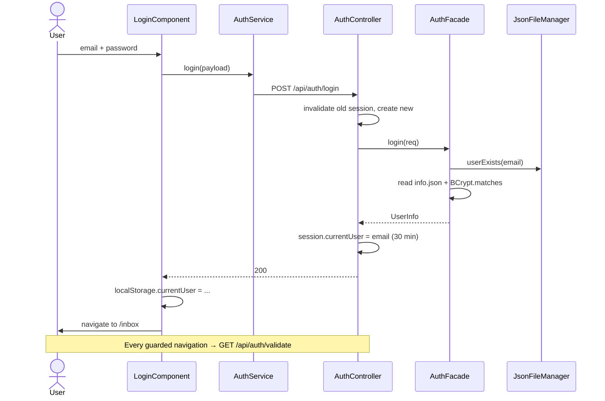

### 2. Compose & send to multiple recipients

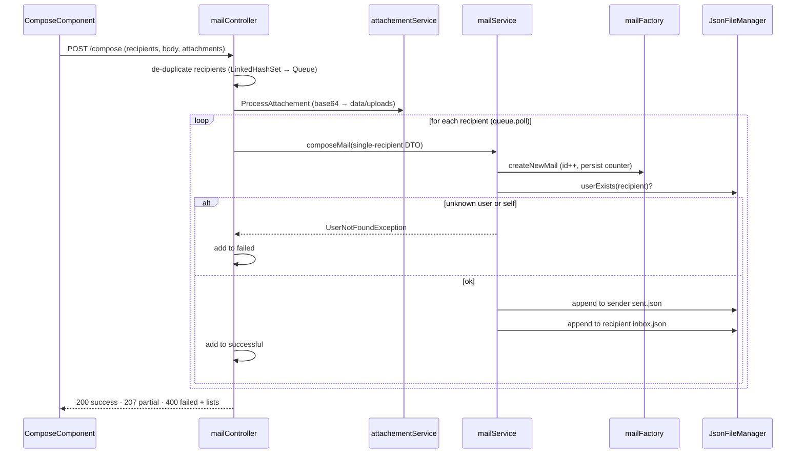

### 3. Filtered, sorted list

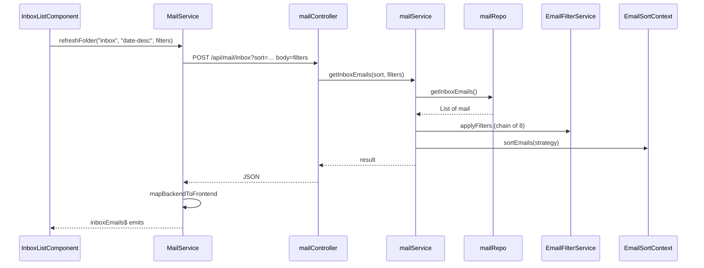

### 4. Delete → trash → purge

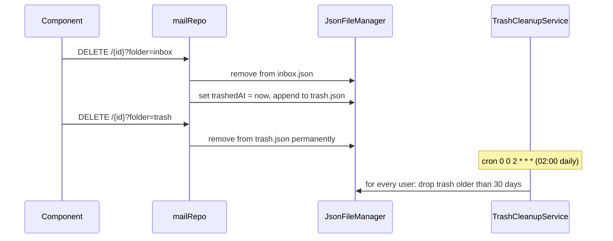

---

## 🧩 Design Patterns

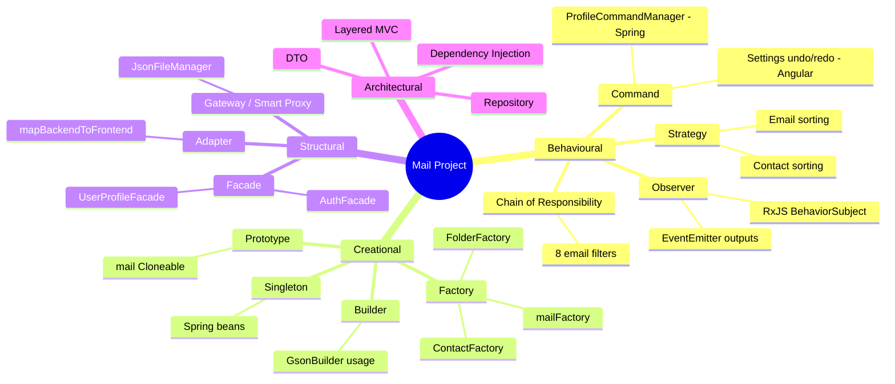

| # | Pattern | Where | Why it is used |
|---|---|---|---|
| 1 | **Strategy** | `EmailSortStrategy` + 4 implementations + `EmailSortContext`; `contactSortStrategy` + `sortByName` / `sortByEmail` | Swap sorting algorithms at runtime by key (`"priority-desc"`). New sort = new class + one `registerStrategy` call; no `if/else` ladder. |
| 2 | **Chain of Responsibility** | `EmailFilter` → `AbstractEmailFilter` → 8 filters, assembled in `EmailFilterService` | Each filter handles one criterion then forwards. Filters are optional, independent and re-orderable. |
| 3 | **Template-style abstract base** | `AbstractEmailFilter` (`next`, `setNext`, `passToNext`) | Removes duplicated chaining code from every concrete filter. |
| 4 | **Factory** | `mailFactory.createNewMail` (static; id, timestamp, preview, defaults), `ContactFactory`, `FolderFactory` (Spring `@Component`s) | One place owns "how a valid object is born": UUIDs, initials, avatar colour, primary-flag guarantee, 100-char preview. |
| 5 | **Facade** | `AuthFacade`, `UserProfileFacade` | Controllers get a tiny API (`signup`, `login`, `updateProfile`) while the facade coordinates file reads, BCrypt, validation and undo recording. |
| 6 | **Repository** | `mailRepo`, `FolderRepo`, `contactRepo` | Services talk to collections, not file paths. Storage could move to a DB without touching services. |
| 7 | **DTO** | `DTOS/` package | Decouples wire contracts from persisted models (e.g. `contactRequestDTO.emails` vs `Contact.email`; no password hash ever leaves via a DTO). |
| 8 | **Singleton** | Every `@Service` / `@Component` / `@Repository` / controller (Spring default scope); `static final Gson`; `mailFactory` static counter | One shared instance; stateless collaborators. |
| 9 | **Dependency Injection** | Constructor injection (`mailController`, `AuthFacade`, `mailRepo`) and `@Autowired` fields | Inversion of control; testability. |
| 10 | **Command** (backend) | `ProfileCommandManager` + `ProfileChange(field, old, new)` with undo/redo `Stack`s per user | Reversible profile edits; new edits clear the redo stack; history capped and expired (TTL). |
| 11 | **Command** (frontend) | `Command` interface, `UpdateFieldCommand`, `UpdatePhotoCommand`, `CommandManager` | Undo/redo on the settings form; history truncation on new command. |
| 12 | **Observer / Pub-Sub** | `BehaviorSubject`/`Subject` in `MailService`, `EmailStateService`, `ComposeService`, `DispatcherSettingsService`; `@Output EventEmitter` in modals/pager | Components react to state without referencing each other. |
| 13 | **Adapter** | `MailService.mapBackendToFrontend` / `extractSenderName` | Converts backend field names (`starred`, `from`) into the UI model (`isStarred`, `sender`, `senderEmail`). |
| 14 | **Gateway / Smart Proxy** | `JsonFileManager` | Single controlled entry point to the file system; hides I/O, serialisation and paths. |
| 15 | **Builder (consumer)** | `new GsonBuilder().setPrettyPrinting().registerTypeAdapter(…).create()` | Declarative configuration of the JSON engine. |
| 16 | **Prototype** | `mail implements Cloneable` with attachment-list deep copy | Copying a message without sharing mutable state. |
| 17 | **Mediator-like shared state** | `EmailStateService`, `ComposeService` | List ↔ Reader ↔ Compose communicate through a service instead of parent/child wiring. |
| 18 | **Guard (route interceptor)** | `authGuard` | Cross-cutting access control for the entire protected route subtree. |
| 19 | **Scheduler / Job** | `TrashCleanupService` with `@Scheduled` | Autonomous background housekeeping. |
| 20 | **Layered MVC / Container–Presentational** | Controller→Service→Repo; list components (smart) + `PaginationComponent`/`FilterModalComponent` (dumb, input/output only) | Separation of concerns on both tiers. |

---

## 🏛️ OOP Principles & SOLID

### The four pillars

| Pillar | Evidence in the code |
|---|---|
| **Encapsulation** | Models keep private fields behind Lombok getters/setters; `mailRepo`/`JsonFileManager` hide paths and I/O; `AbstractEmailFilter.next` is `protected`; `ProfileCommandManager` keeps its stacks private and exposes `undo/redo/canUndo`; `ContactFactory` hides `ensurePrimary*` and colour logic as `private` helpers. |
| **Abstraction** | Interfaces `EmailFilter`, `EmailSortStrategy`, `contactSortStrategy`, `Command` describe *what*, not *how*. Callers (`EmailSortContext`, `EmailFilterService`, `CommandManager`) never see concrete types at the call site. |
| **Inheritance** | `AbstractEmailFilter` → 8 concrete filters (shared chaining); `UserNotFoundException extends Exception`. Interface implementation is used for strategies/commands. |
| **Polymorphism** | `strategy.sort(emails)` and `next.apply(emails)` dispatch dynamically; `command.execute()/undo()` behaves differently per command; `Comparator<mail>` implementations. |

### SOLID

| Principle | How it shows up | Honest caveat |
|---|---|---|
| **S** — Single Responsibility | One filter = one criterion; one strategy = one ordering; factories only build; `attachementService` only handles files; `TrashCleanupService` only purges. | `mailService` also does direct file I/O for compose/move and is the largest class. |
| **O** — Open/Closed | Add a sort by registering a class; add a filter by writing a class and linking it — no edits to existing strategies/filters. | `ContactService.getStrategy` and `buildFilterChain` still need a one-line edit for new variants. |
| **L** — Liskov Substitution | Any `EmailSortStrategy`/`EmailFilter`/`Command` can replace another without callers noticing. | — |
| **I** — Interface Segregation | Interfaces are tiny: `EmailFilter` (2 methods), `contactSortStrategy` (1), `Command` (4). | — |
| **D** — Dependency Inversion | `EmailSortContext` depends on `EmailSortStrategy`; services receive repositories/factories from the container. | Some services depend on concrete classes (e.g. `mailService` → `mailRepo`, `JsonFileManager`). |

### Other design principles in play

* **Separation of concerns** — controllers (HTTP) / facades+services (rules) / repos (persistence) / utils (I/O).
* **DRY** — shared `passToNext`, shared mailbox pipeline, shared Angular pager/filter modal.
* **Composition over inheritance** — `EmailSortContext` *has* strategies; `mail` *has* attachments; services *have* repos.
* **Fail-safe defaults** — missing file → empty list; `InfoPlus.DispatcherSettings` starts with everything **off** (opt-in); unknown sort key → `date-desc`.
* **Generics** — `JsonFileManager.readListFromFile<T>(path, Type)` works for any model via Gson `TypeToken`.
* **Immutability where cheap** — `final` collaborators, `static final` type tokens and formatters.
* **Defensive programming** — null-safe lists in `contactRepo`, `Optional` in `FolderRepo`/`FolderService`.

---

## 📐 Data Structures & Algorithms Used

| Structure | Where | Purpose |
|---|---|---|
| `PriorityQueue<mail>` (binary min-heap) | `SortByPriorityStrategy`, `PriorityFilter`, `mailService.getInboxEmailsByPriority` | Drain mail in priority order — **O(n log n)**; with `EmailPriorityComparator` ties break newest-first |
| `Queue<String>` (`LinkedList`) | `mail.to`, `mailContentDTO.recipients`, compose loop | FIFO processing of recipients with `poll()` |
| `LinkedHashSet<String>` | `mailController.composeMail` | De-duplicate recipients **preserving order** |
| `Stack<ProfileChange>` ×2 | `ProfileCommandManager` | Undo / redo stacks (LIFO), capped at 50 |
| `ConcurrentHashMap<String, …>` | `ProfileCommandManager` | Thread-safe per-user histories + last-access timestamps |
| `HashMap<String, EmailSortStrategy>` | `EmailSortContext` | **O(1)** strategy lookup by key |
| `Comparator` + `nullsLast`, `reversed()` | Sort strategies | Null-safe, direction-aware ordering |
| `Collections.sort` (stable TimSort) | Date / sender / subject strategies | Stable sorting |
| `List.subList(start, end)` | `ContactService.getContacts` | Server-side pagination (`start = page × size`) |
| Java Streams / `Optional` | Filters, repos | Declarative filtering and null handling |
| `Set<string>`, `Map<string, BehaviorSubject>` | Angular list components, `MailService` | Selection tracking; per-folder pending-update flags |

Filtering is a linear pipeline: **O(n · k)** for *n* mails and *k* active filters.

---

## 🔐 Security Model

| Concern | Implementation |
|---|---|
| **Password storage** | BCrypt (`BCryptPasswordEncoder`) in `info.json`; plaintext is never stored or returned |
| **Authentication** | Server-side `HttpSession` attribute `currentUser`; new session on every login (old one invalidated → prevents session fixation); 30-minute inactivity timeout |
| **Route protection (client)** | `authGuard` checks local state **and** validates with the server before activating routes |
| **Account rules** | `@gmail.com` addresses only; duplicate accounts rejected; recipients must be registered users; sending to yourself is rejected |
| **Input validation** | Jakarta Validation on contacts (`@NotBlank`, `@Email`) and folders via `@Valid`; password-change rules (≥ 8 chars, confirmation match); base64 data-URI check for profile photos |
| **CORS** | Allow-list of dev origins (`localhost:4200` etc.) with credentials |
| **Isolation** | Each user's data lives under `data/users/<email>/` |

> ⚠️ This is a learning/portfolio-grade security setup. See [Known Limitations](#-known-limitations--roadmap) before exposing it beyond localhost.

---

## 🚀 Getting Started

### Prerequisites

* **JDK 17**
* **Node.js 18.13+** (or 20+) and **npm**
* Git (optional) — Maven is **not** required, the wrapper is included

### 1 · Run the backend

```bash
cd backend
./mvnw spring-boot:run          # Windows: mvnw.cmd spring-boot:run
```

* Starts on **http://localhost:8080**
* ⚠️ **Run it from the `backend/` directory** — all storage paths (`data/users/`, `data/uploads/`, `data/mail_counter.txt`) are relative to the working directory.

### 2 · Run the frontend

```bash
cd mail-Frontend
npm install
npm start                       # = ng serve  → http://localhost:4200
```

The `development` configuration is the default for `ng serve` and talks to `http://localhost:8080` through `src/environments/environment1.ts`.

### 3 · Try it

1. Open `http://localhost:4200` and **Sign up** with a `@gmail.com` address (e.g. `alice@gmail.com`).
2. Open a **private/incognito window** and sign up a second user (e.g. `bob@gmail.com`) — sessions and `localStorage` are shared per browser profile.
3. As Alice: **Compose** → recipient `bob@gmail.com`, pick a priority, attach a file, send.
4. As Bob: watch the Inbox (new mail appears via the 5-second poll indicator), open it in the reader, star it, move it into a new custom folder, then delete it twice to see trash → permanent deletion.

> The repo ships with four sample user directories under `backend/data/users/`. Their passwords are BCrypt-hashed, so create fresh accounts for testing.

### Production-style builds

```bash
# Backend → backend/target/backend-0.0.1-SNAPSHOT.jar
cd backend && ./mvnw clean package
java -jar target/backend-0.0.1-SNAPSHOT.jar      # run from backend/

# Frontend → mail-Frontend/dist/mail
cd mail-Frontend && npx ng build
```

---

## ⚙️ Configuration

| Setting | Value | Location |
|---|---|---|
| Backend port | `8080` (Spring default; `application.properties` only sets the app name) | `backend/src/main/resources/application.properties` |
| API base URL | `http://localhost:8080` (`environment1`) · `http://localhost:8081` (`environment2`) | `mail-Frontend/src/environments/` |
| Angular build configs | `production` (default for `build`), `development` (default for `serve`), `dev2` (port **4201**, API **8081**) | `angular.json` |
| CORS origins | `4200`, `59007`, `61458`, `56857` (global) + per-controller `@CrossOrigin` | `config/CorsConfig.java`, controllers |
| Session timeout | 1800 s (30 min) | `AuthController.login` |
| Polling interval | 5000 ms | `MailService.pollingInterval` |
| Trash retention | 30 days | `TrashCleanupService.DAYS_TO_KEEP` |
| Trash purge schedule | `0 0 2 * * *` (daily at 02:00) | `TrashCleanupService` |
| Undo history | 50 entries; server TTL 30 min | `ProfileCommandManager`, `CommandManager` |
| Mail preview length | 100 characters | `mailFactory` |
| Min password length (change) | 8 | `PasswordChangeRequest` |
| Data root | `data/` relative to working dir | `JsonFileManager`, repos, `attachementService` |

---

## 🧪 Testing

| Tier | Command | Status |
|---|---|---|
| Backend | `cd backend && ./mvnw test` | A single `@SpringBootTest` `contextLoads()` smoke test |
| Frontend | `cd mail-Frontend && npm test` | Karma + Jasmine; CLI-generated `*.spec.ts` files accompany most components |

> The filter chain, sort strategies, factories and `ProfileCommandManager` are all pure, dependency-light classes — excellent first targets for unit tests.

---

## 🧭 Known Limitations & Roadmap

Observations from reading the code, ordered roughly by impact. None of them prevent local use, but they matter before any real deployment.

### Correctness & security

| # | Finding | Suggested fix |
|---|---|---|
| 1 | **Shared mutable state in a singleton.** `mailService` has a `senderEmail` field (with a Lombok setter). Several controllers call `mailService.setSenderEmail(user)`, and `getLoggedInUser()` prefers that field over the session — so with concurrent users, one user's value can leak into another's requests. | Remove the field; pass the user (from the session) explicitly or resolve it per request only. |
| 2 | **No central authentication layer.** Controllers read the session individually; `request.getSession()` (create = true) can yield a `null` user, which then flows into paths such as `data/users/null/…`. | Add a `HandlerInterceptor` / Spring Security filter and reject unauthenticated calls with `401`. |
| 3 | **Attachment endpoint is unauthenticated** and normalises the path without confirming it stays inside `data/uploads/`. | Check `resolvedPath.startsWith(uploadRoot)`, and authorise by mail ownership. |
| 4 | **Folder deletion loses mail.** `FolderService.deleteFolder` is documented as "move emails to inbox" but deletes `folder_<id>.json` and the metadata. | Move the mails to the inbox before deleting, or fix the doc. |
| 5 | **Signup validation is thin** (only the `@gmail.com` suffix). | Add `@Valid` constraints on `SignupRequest` (email format, password strength). |
| 6 | **JSON error bodies are built by string concatenation**, so quotes in messages break the JSON. | Return a `Map`/record and add a `@ControllerAdvice`. |

### Persistence & concurrency

| # | Finding | Suggested fix |
|---|---|---|
| 7 | Whole-file read-modify-write with `synchronized` on **per-instance lock objects** (separate in `mailRepo` and `mailService`) — not per-user/file, and not atomic across classes; a crash mid-write can corrupt a file. | Write to a temp file then atomically move; or adopt a database (JPA + H2/PostgreSQL). |
| 8 | The repository abstraction is bypassed: `mailService` reads/writes files directly for compose/move/draft; facades use raw `FileWriter`; `"data/users/"` is duplicated in many classes. | Route all I/O through repos/`JsonFileManager`; centralise paths in one config property. |
| 9 | Multi-recipient send creates a separate mail id and a separate **Sent** copy per recipient. | Create one sent copy with all recipients. |
| 10 | Mail ids come from a static counter in a text file (not safe across multiple instances). | Use UUIDs or database sequences. |

### Code quality & project hygiene

| # | Finding | Suggested fix |
|---|---|---|
| 11 | Naming deviates from Java conventions: classes `mail`, `mailRepo`, `contactRepo`, `attachementService`; packages `Repo`, `DTOS`, `Util`, `Factory`. API field names `piriority` and `attachements` are typos baked into the contract. | Rename (and version the API if clients exist). |
| 12 | CORS configured in two places with different origin lists; `dev2` (port 4201) is not in the allow-list. | One `CorsConfig` driven by properties. |
| 13 | `DispatcherSettingsService` hard-codes `http://localhost:8080`, unlike the other services (`environment1`). `angular.json` `development` replaces `environment1` with itself (no-op); files are named `environment1/2` instead of `environment.ts` / `environment.prod.ts`. | Standard environment files + `fileReplacements`. |
| 14 | `core/utils/*.ts` are empty placeholders; several npm packages (`animejs`, `gsap`, `daisyui`, `flowbite`, `ngx-toastr`, `ngx-pagination`, `@ngneat/tailwind`) have no imports in `src/`. | Delete or implement. |
| 15 | Repository contains runtime artefacts: `data/uploads/*` (user files), `data/users/*` (hashed credentials), `mail-Frontend/src.zip`. | Add to `.gitignore`; ship a small anonymised seed instead. |
| 16 | Server-side undo/redo endpoints exist, but `UserProfileController.updateProfile` clears the history right after saving, and the Settings screen uses the client-side `CommandManager`. | Choose one source of truth. |
| 17 | Dispatcher Mode's AI flags (`autoSummarizeUrgent`, `smartReply`, `priorityScoring`) and timeline/metrics are stored settings only — no implementation was found. | Implement or label as "coming soon". |
| 18 | `ContactFactory.generateInitials` would throw on a blank name or consecutive spaces. | Filter empty segments. |
| 19 | Many `System.out.println` debug traces in controllers/services/guard. | Use SLF4J with levels. |

### Roadmap ideas

* 🔒 Spring Security (session + CSRF, or JWT) and role-aware authorisation
* 🗄️ Replace JSON files with JPA (H2 for dev, PostgreSQL for prod) — repositories are already the seam
* ⚡ Replace 5-second polling with **Server-Sent Events** or WebSocket push
* 📄 OpenAPI / Swagger via `springdoc-openapi`
* 🧪 Unit tests for filters, strategies, factories, command manager; Angular service tests with `HttpTestingController`
* 🐳 Dockerfile + `docker-compose` (API + static Angular build behind nginx) and a CI pipeline
* 🅰️ Angular Signals / `@if` control flow, lazy-loaded routes, an HTTP interceptor for `withCredentials` and global error handling
* 🔎 Full-text search index; mail threading; real SMTP/IMAP bridge

---

<div align="center">

**Mail Project** — layered architecture, classic design patterns, and a reactive UI, with nothing but JSON files underneath.

</div>
